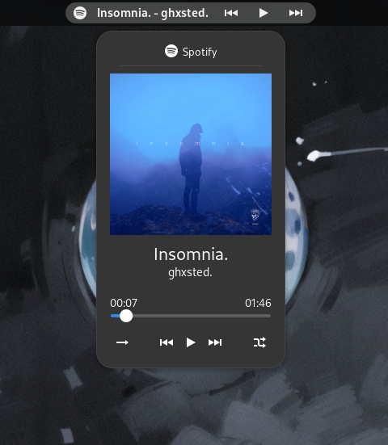
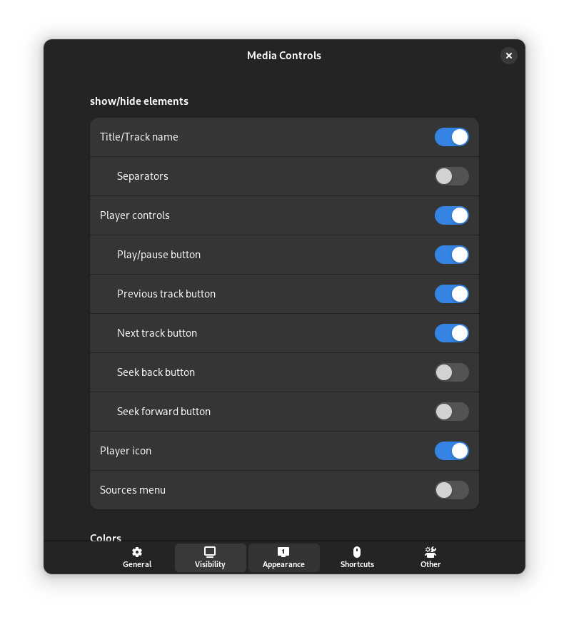
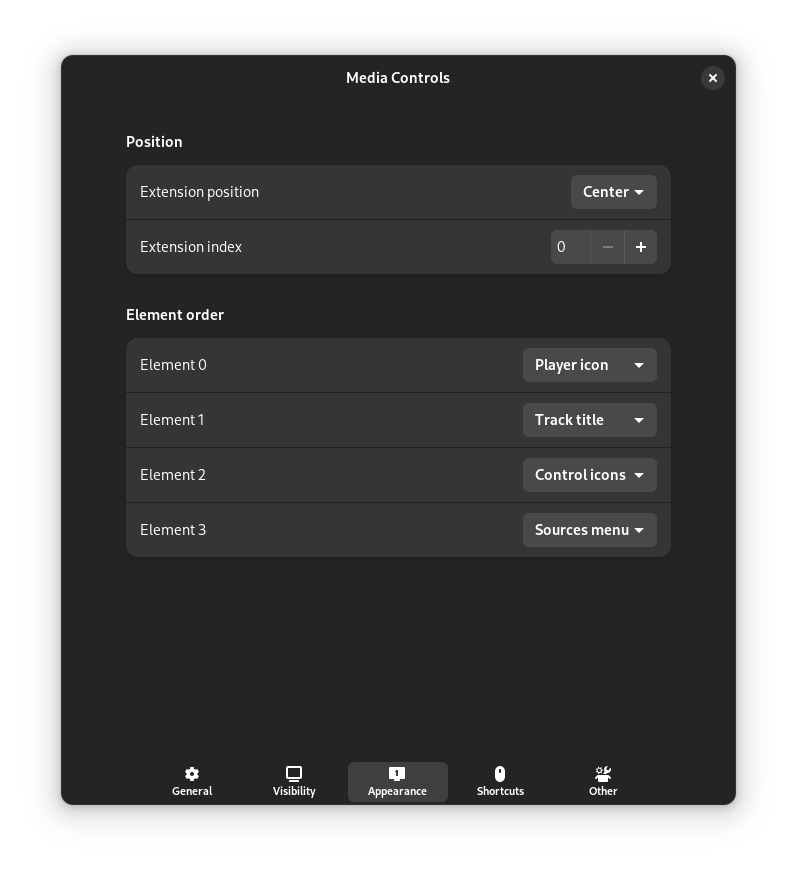
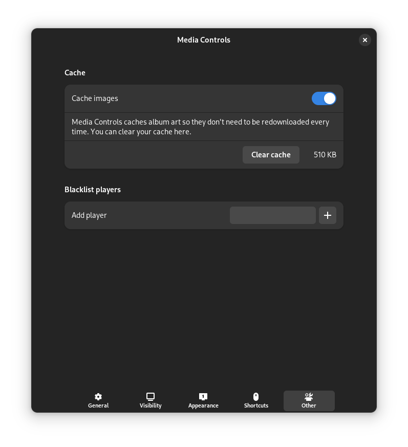

## What does this extension do?

Show controls and information of the currently playing media in the panel.

## Features

-   Customize how the extension looks
-   Disable elements you don't want
-   Invoke different actions in many ways through mouse actions
-   Basic media controls (play/pause/next/prev)
-   Other media controls (loop/shuffle)
-   And more...

---

## Notes

-   Supports GNOME 3.36 and 3.38 (unmaintained), 40, 41, 42, 43, 44 and 45.
-   GNOME 44 and below will not receive updates after v29/v28;

---

## Reporting issues

-   Please attach a screenshot when you report something about visuals
-   Please include version of the extension, gnome version and linux distribution

---

## How to install

#### Install from extensions.gnome.org (Recommended)

#### Arch Linux (AUR)

`yay -S gnome-shell-extension-media-controls` _Stable release_

`yay -S gnome-shell-extension-media-controls-git` _Build of the main branch_

#### Other distributions

Install from source

-   Download "extension.zip" file from the releases tab
-   Open a terminal in the path of extension.zip
-   Install and enable the extension by executing `gnome-extensions install extension.zip --force` in the terminal

---

## Contributing

Pull requests are welcome.

To update the translation files run `./debug.sh -t` in the extensions directory after your code changes are finished. This will update the files in po folder. Then poedit (https://poedit.net/download) can be used to translate the strings. poedit can also be used to create new localization files.

## Screenshots

#### Track information menu

#### Sources menu

#### General settings

#### Visibility settings

#### Appearance settings

#### Shortcut settings

#### Other settings

