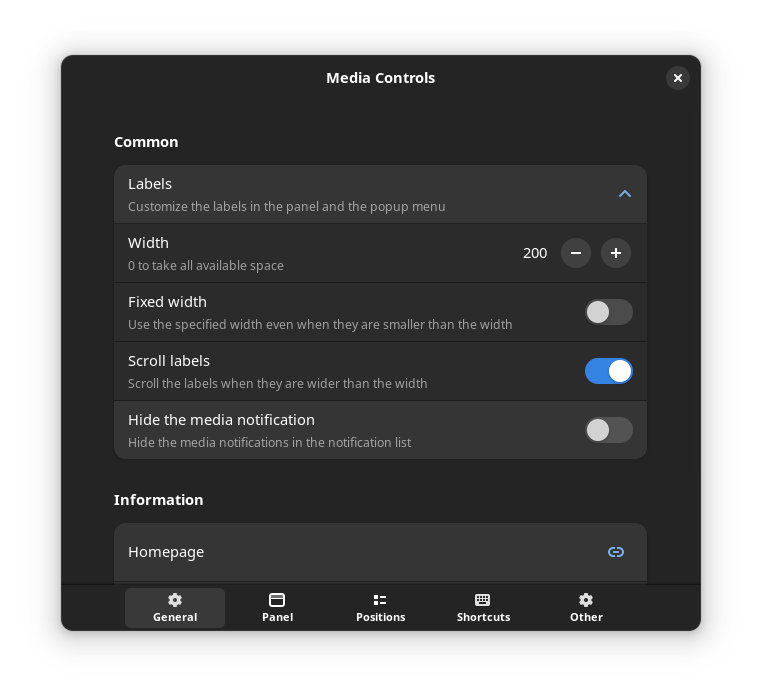
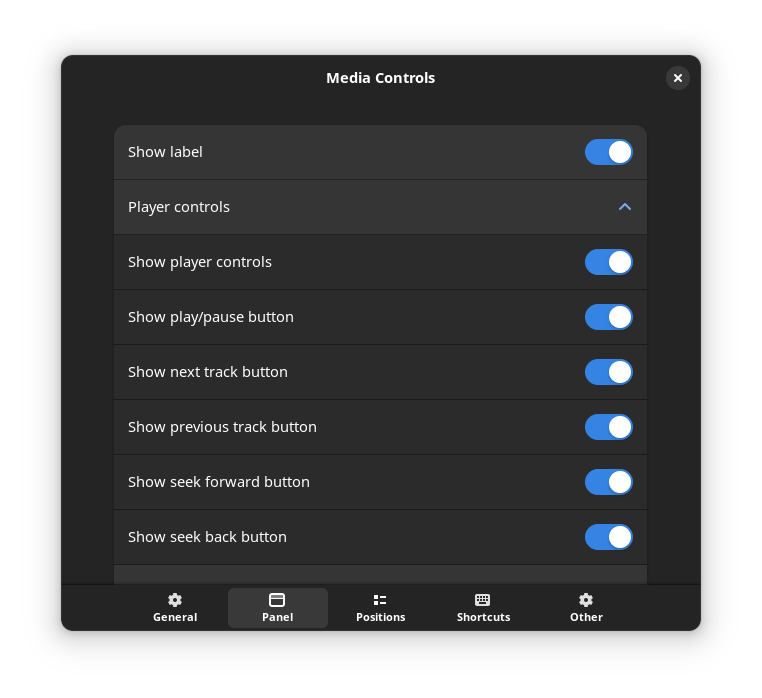
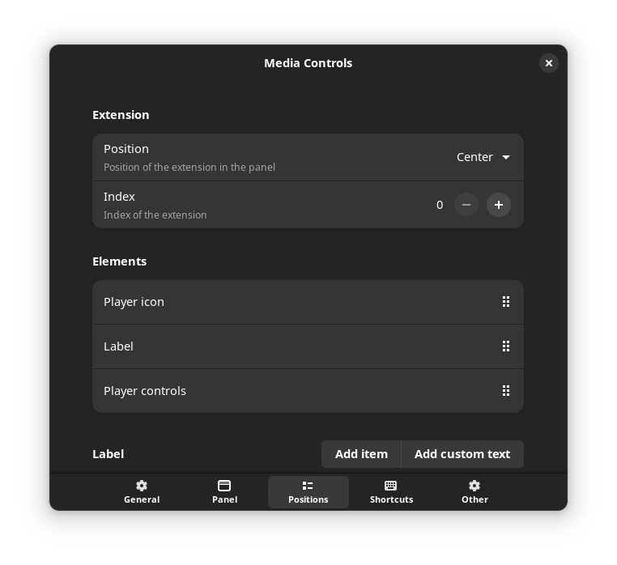
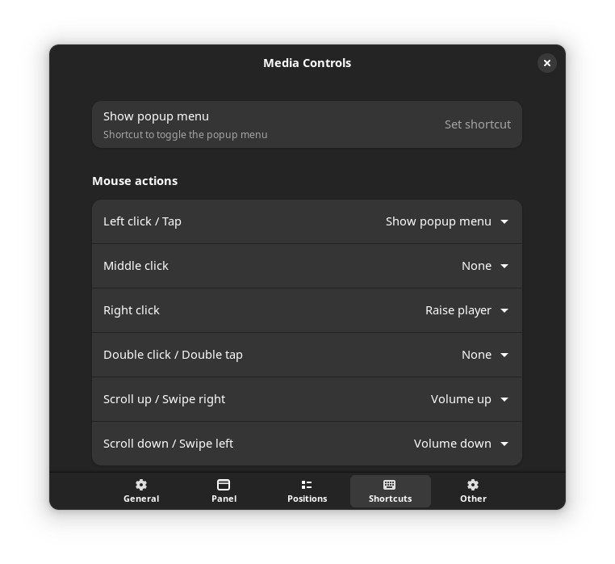
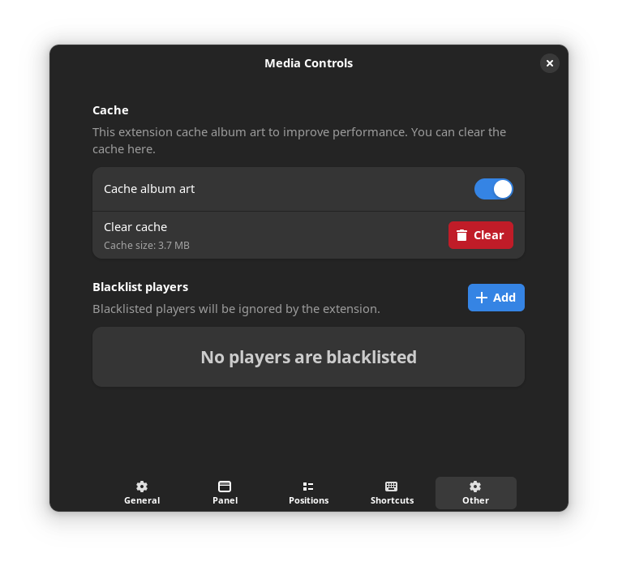

## What does this extension do?

Show controls and information of the currently playing media in the panel.

## Features

- Customize the extension the way you want it
- Basic media controls (play/pause/next/previous/loop/shuffle/seek)
- Mouse actions lets you run different actions via left/middle/right/scroll.
- Popup with album art and a slider to control the playback
- Scrolling animations
- Blacklist players

---

## Reporting issues

- Please attach a screenshot when you report something about visuals
- Please include version of the extension, gnome version and linux distribution

---

## How to install

#### Install from extensions.gnome.org (Recommended)

#### Manual installation

Install from source

- Download archive file from the releases tab
- Open a terminal in the directory containing the downloaded file
- Install and enable the extension by executing `gnome-extensions install extension.zip --force` in the terminal

---

## Contributing

Pull requests are welcome.

To update the translation files run `./debug.sh -t` in the extensions directory after your code changes are finished. This will update the files in po folder. Then poedit (https://poedit.net/download) can be used to translate the strings. poedit can also be used to create new localization files.

Made with [contrib.rocks](https://contrib.rocks).

## Screenshots

#### Popup menu

#### General settings

#### Panel settings

#### Position settings

#### Shortcut settings

#### Other settings

