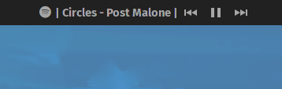

## What does this extension do?

Show controls and information of the currently playing media in the panel

## Features

-   Shows the title and the artist
-   Shows the media player icon if possible
-   Show controls for the media

---

## Notes

<<<<<<< HEAD
-   Only supports GNOME 40+
=======
-   Only support Gnome 3.38 and 40

>>>>>>> e91a2aaefbc557e39484a9c66d9dd03f42fb5822
---

## Screenshots

## How to install

Install from extensions.gnome.org

or

Install from source
-   Download and extract the zip file in the releases tab
-   Rename the extracted folder to `mediacontrols@cliffniff.github.com`
-   Move it to `~/.local/share/gnome-shell/extensions/`
-   Enable the extension in the Extensions app or type `gnome-extensions enable mediacontrols@cliffniff.github.com` in the terminal
<<<<<<< HEAD

## Upcoming features

-  ~Support for video players~ [DONE]
-  ~Desaturated player icon~ [DONE]
-  ~Clickable title with actions~ [DONE]

*This extension has been updated to be more compatible with JovarkOS. Updates have been made by @lucasburlingham*
=======
>>>>>>> e91a2aaefbc557e39484a9c66d9dd03f42fb5822
